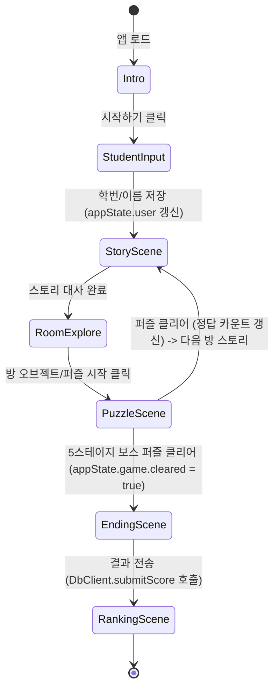
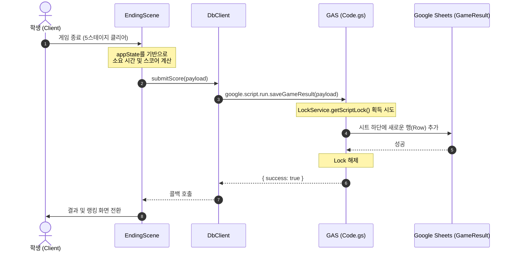

# PROJECT_GUIDE.md

이 문서는 「Geometry Escape: 기하의 성」 프로젝트의 초기 구조 설계 및 구현 가이드라인을 정의합니다.

---

## 1. 프로젝트 구조

본 프로젝트는 **Google Apps Script (GAS) Web App** 환경에서 구동되는 단일 페이지 애플리케이션(SPA)입니다.
로컬 환경에서는 관리성과 협업 편의를 위해 HTML/CSS/JS 파일을 분할하여 개발하고, 배포 시에는 GAS 템플릿 엔진을 사용하여 단일 HTML 문서로 빌드되어 서빙됩니다.

### 아키텍처 원칙 (SoC)
- **UI (HTML/CSS):** 사용자 인터페이스 및 화면 레이아웃 정의
- **Service (Client-side JS):** 게임 흐름 제어, 씬 전환(Scene Engine), 스토리 재생(Story Engine), 퍼즐 캔버스 제어(Puzzle Engine)
- **Repository (GAS/Sheets):** 결과 데이터 검증 및 저장(ScriptLock 적용), 순위표 데이터 조회

---

## 2. 디렉토리 구조

프로젝트 루트 디렉토리의 구성안입니다.

```text
room-math1-plane figure/
├── .clasp.json           # clasp 설정 파일 (GAS 프로젝트 매핑)
├── clasp.json            # clasp 설정 백업 또는 관련 정보
├── package.json          # 개발용 의존성 및 clasp 스크립트 정의
├── PROJECT_GUIDE.md      # 프로젝트 개발 가이드 (본 문서)
├── STATUS.md             # 프로젝트 진행 상태 기록 문서
├── docs/                 # 요구사항 및 규칙 문서
│   ├── prd.md
│   ├── RULES_v4.0.md
│   └── KNOWLEDGE_v4_FINAL.md
└── src/                  # 소스 코드 폴더
    ├── appsscript.json   # GAS 매니페스트 파일
    ├── Code.js           # GAS 백엔드 코드 (doGet 및 시트 API)
    ├── Index.html        # 메인 HTML 템플릿 (Layout 및 Container)
    ├── Styles.html       # CSS 스타일 파일 (Index.html에 include)
    ├── App.html          # 클라이언트 코어 및 글로벌 상태 관리 (Index.html에 include)
    ├── SceneEngine.html  # 화면(Scene) 전환 엔진 (Index.html에 include)
    ├── StoryEngine.html  # 스토리 진행 엔진 및 대사 데이터 (Index.html에 include)
    ├── PuzzleEngine.html # SVG/Canvas 기반 퍼즐 공통 인터페이스 및 스테이지별 구현 (Index.html에 include)
    └── DbService.html    # GAS 서버 API 비동기 호출 Wrapper (Index.html에 include)
```

---

## 3. 파일별 책임 (File Responsibilities)

| 파일명 | 유형 | 주요 책임 |
| :--- | :--- | :--- |
| `Code.js` | Backend | - 웹앱 진입점(`doGet`) 처리<br>- 스프레드시트 결과 저장 및 랭킹 조회 API 제공<br>- `ScriptLock`을 이용한 동시성 제어 및 예외 처리 |
| `Index.html` | UI | - 전체 HTML 레이아웃 및 씬(Scene)별 컨테이너 구성<br>- 각 리소스 파일(`.html`)들을 로딩 및 인클루드 |
| `Styles.html` | Style | - 판타지 풍 테마 스타일링(CSS)<br>- 반응형 레이아웃(PC/모바일 지원) 및 트랜지션 애니메이션 |
| `App.html` | Service | - 앱 초기화 및 이벤트 리스너 바인딩<br>- 클라이언트 상태(`appState`) 정의 및 중앙 제어 |
| `SceneEngine.html`| Service | - 화면 상태 전환 제어 (DOM 제어)<br>- 씬 전환 시의 생명주기 이벤트(진입/퇴장) 관리 |
| `StoryEngine.html`| Service | - 대사 렌더링 및 스토리 흐름 제어<br>- 스테이지별 텍스트 데이터 템플릿 관리 |
| `PuzzleEngine.html`| Service | - SVG/Canvas 기반 도형 조작 및 충돌 판정<br>- 각 스테이지별 퍼즐 로직 객체화 |
| `DbService.html` | Service | - `google.script.run` 호출을 추상화하여 비동기 응답 처리 |

---

## 4. 클래스/객체별 책임 (Class/Object Responsibilities)

과도한 엔터프라이즈 설계를 피하기 위해 JavaScript 모듈 패턴(싱글톤 객체)을 지향합니다.

### 4.1. `SceneManager` (객체)
- **책임:** 현재 씬을 추적하고 UI 화면을 토글합니다.
- **주요 속성:** `currentSceneId`
- **핵심 메서드:** `showScene(sceneId, data)`

### 4.2. `StoryManager` (객체)
- **책임:** 스테이지별 대사 큐를 로드하고, 클릭할 때마다 순차적으로 텍스트를 출력합니다.
- **주요 속성:** `dialogQueue`, `currentStage`
- **핵심 메서드:** `startStory(stageId, onComplete)`, `nextDialog()`

### 4.3. `PuzzleManager` (객체)
- **책임:** 현재 스테이지에 맞는 퍼즐 클래스를 인스턴스화하고 SVG/Canvas 컨테이너를 연결합니다.
- **주요 속성:** `activePuzzleInstance`
- **핵심 메서드:** `loadPuzzle(stageId, containerId, onCleared)`, `unloadPuzzle()`

### 4.4. `PuzzleBase` (추상 인터페이스 또는 기본 클래스)
- **책임:** 개별 퍼즐 객체가 가져야 할 공통 인터페이스 규격입니다.
- **메서드:**
  - `init(containerId)`: 캔버스/SVG 초기 설정 및 이벤트 리스너 등록
  - `render()`: 화면 그리기
  - `checkAnswer()`: 유저 입력값과 수학적 정답 조건 비교
  - `destroy()`: 메모리 해제 및 이벤트 리스너 정리

### 4.5. `DbClient` (객체)
- **책임:** 클라이언트 사이드에서 백엔드 GAS API를 안전하게 비동기 호출합니다.
- **핵심 메서드:** `submitScore(payload, onSuccess, onFailure)`, `getLeaderboard(onSuccess, onFailure)`

---

## 5. 함수 인터페이스 (Function Interfaces)

### 5.1. Backend (`Code.js`)

```javascript
/**
 * Web App HTTP GET 요청을 처리하여 Index.html 페이지를 렌더링합니다.
 */
function doGet(e) { /* ... */ }

/**
 * HTML 조각을 메인 파일에 포함시키기 위한 헬퍼 함수입니다.
 */
function include(filename) { /* ... */ }

/**
 * 학생의 게임 완료 기록을 Google Sheets에 저장합니다.
 * @param {Object} resultDto - 결과 정보 객체 (학번, 이름, 소요시간 등)
 * @returns {Object} { success: boolean, message: string }
 */
function saveGameResult(resultDto) { /* ... */ }

/**
 * 상위 랭킹 리스트를 가져옵니다.
 * @returns {Array<Object>} 랭킹 목록 배열
 */
function getLeaderboard() { /* ... */ }
```

### 5.2. Client-side Common (`App.html`, `DbService.html`)

```javascript
/**
 * 클라이언트 글로벌 상태
 */
const appState = {
  user: { studentNo: "", name: "" },
  game: {
    currentStage: 1,
    startTime: null,
    endTime: null,
    correctCount: 0,
    wrongCount: 0,
    hintCount: 0,
    cleared: false,
    score: 0
  },
  currentScene: "intro"
};

/**
 * DB 서비스 래퍼
 */
const DbClient = {
  submitScore: function(payload, onSuccess, onFailure) {},
  getLeaderboard: function(onSuccess, onFailure) {}
};
```

### 5.3. Client-side Engines (`SceneEngine.html`, `StoryEngine.html`, `PuzzleEngine.html`)

```javascript
/**
 * 화면 전환 제어
 */
const SceneManager = {
  showScene: function(sceneId) {}
};

/**
 * 스토리 제어
 */
const StoryManager = {
  startStory: function(stageId, callback) {},
  nextDialog: function() {}
};

/**
 * 퍼즐 로더 및 실행 인터페이스
 */
const PuzzleManager = {
  loadPuzzle: function(stageId, containerId, callback) {},
  clearActivePuzzle: function() {}
};

// 각 개별 퍼즐 클래스 프로토타입 예시 (예: RotationPuzzle)
class RotationPuzzle {
  constructor(canvasElement) {}
  init() {}
  render() {}
  handleEvent(event) {}
  checkAnswer() {}
  destroy() {}
}
```

---

## 6. 상태 관리 구조 (State Management)

글로벌 `appState`는 앱의 유일한 진실 공급원(Single Source of Truth)으로 관리됩니다.



- **상태의 격리:** UI 엘리먼트는 직접적으로 게임 데이터를 소유하지 않으며, `appState` 변경 이벤트에 반응하여 DOM을 다시 그리는 단순 반응형 구조를 유지합니다.
- **예외 복구:** 네트워크 지연 등으로 데이터 저장 중 브라우저가 리프레시되는 상황을 방지하기 위해 `beforeunload` 이벤트 리스너를 제공합니다.

---

## 7. 데이터 흐름 (Data Flow)

### 7.1. 게임 데이터 쓰기 (점수 제출 흐름)



---

## 8. 외부 연동 구조 (GAS -> Google Sheets)

### 8.1. Google Sheets 스키마 정의

#### Students 시트 (학생 리스트)
| Column | Type | Description |
| :--- | :--- | :--- |
| `studentNo` | String | 학번 (예: "10101") |
| `name` | String | 이름 (예: "홍길동") |

#### GameResult 시트 (게임 결과 기록)
| Column | Type | Description |
| :--- | :--- | :--- |
| `id` | String | 결과 고유 ID (UUID 형식) |
| `studentNo` | String | 학번 |
| `name` | String | 이름 |
| `startTime` | DateTime | 게임 시작 일시 |
| `endTime` | DateTime | 게임 종료 일시 |
| `playTime` | Number | 총 소요시간 (초 단위) |
| `score` | Number | 최종 획득 점수 |
| `correctCount`| Number | 정답 맞춘 횟수 |
| `wrongCount` | Number | 오답 제출 횟수 |
| `hintCount` | Number | 힌트 조회 횟수 |
| `cleared` | Boolean | 클리어 여부 |

### 8.2. 동시성 제어 및 쓰기 안정성
- **ScriptLock 구현:** `LockService.getScriptLock()`을 사용하여 여러 명의 학생이 동시에 기록을 제출할 때 발생할 수 있는 데이터 덮어쓰기나 유실 문제를 방지합니다.
- **대기 처리:** 최대 15초(15000ms) 동안 대기하며, 락 획득 실패 시 에러 응답을 제공하여 클라이언트가 재시도할 수 있도록 처리합니다.

---

## 9. 배포 구조 (Deployment Setup)

1. **로컬 개발:** `src/` 디렉토리 내에서 HTML과 JavaScript 소스 코드를 분할하여 작성합니다.
2. **배포 번들링:**
   - GAS 환경에서는 클라이언트 자바스크립트 파일(`DbService.html` 등)을 개별 리소스로 분리하여 저장한 후, `Index.html` 내에서 `<?!= include('FileName'); ?>` 문법을 사용해 합쳐서 로딩합니다.
3. **clasp를 이용한 동기화:**
   - 로컬 작업 완료 시 `git commit` -> `git push`를 우선적으로 수행합니다.
   - 이후 `clasp push` 명령어를 통해 GAS 프로젝트에 소스를 배포합니다.
   - GAS 콘솔에서 웹앱 배포(New Deployment) 버전을 업데이트하여 퍼블리시합니다.

---

## 10. 프로젝트 특화 주의사항 (Project-Specific Rules)

1. **iframe 및 샌드박스 보안 제어:**
   - GAS Web App은 기본적으로 iframe 내에서 구동되므로, 일부 모바일 브라우저의 전체화면 API나 특정 도메인 차단 설정에 걸릴 수 있습니다. `HtmlService.SandboxMode.IFRAME`이 정상 작동하도록 구성합니다.
2. **CSS 디자인 일관성 (Aesthetics):**
   - 템플릿의 판타지 UI 컨셉에 맞추기 위해 일반적인 파랑/빨강 대신 고풍스러운 골드(#D4AF37), 네이비(#1B263B) 등의 다크/클래식 모드 HSL 컬러 팔레트를 채용합니다.
   - 버튼 호버 및 씬 전환 시 부드러운 트랜지션을 주어 모바일 터치 시 시각적 피드백을 제공합니다.
3. **SVG/Canvas 도형 드래그 최적화:**
   - 마우스 드래그 이벤트와 모바일 터치 이벤트(`touchstart`, `touchmove`, `touchend`)를 반드시 동시에 지원해야 합니다.
   - Canvas/SVG 크기가 디바이스 해상도에 동적으로 맞추어질 수 있도록 상대 좌표 변환 처리를 철저히 설계합니다.
