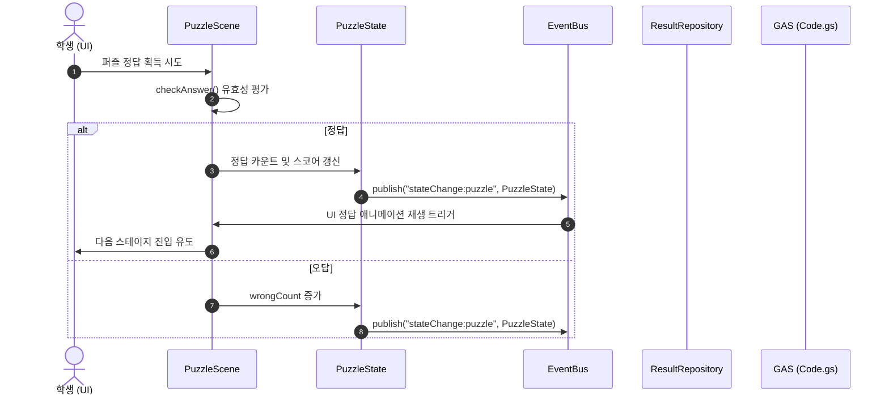

# PROJECT_GUIDE.md

이 문서는 「Geometry Escape: 기하의 성」 프로젝트의 고도화된 초기 구조 설계 및 구현 가이드라인을 정의합니다. 본 설계는 장기 유지보수성, 확장성 및 AI 협업 안정성을 최우선으로 고려하였습니다.

---

## 1. 프로젝트 구조

본 프로젝트는 **Google Apps Script (GAS) Web App** 환경에서 구동되는 단일 페이지 애플리케이션(SPA)입니다.
로컬에서는 모듈성 극대화를 위해 각 파일과 디렉토리를 세분화하여 개발하고, 배포 시에는 GAS의 `include` 구문을 활용해 단일 HTML 문서로 빌드되어 서빙됩니다.

### 아키텍처 원칙 (SoC)
- **UI (Scenes):** 개별 Scene 모듈이 자체적인 DOM 렌더링 및 라이프사이클을 소유.
- **Service (Repositories/Services):** 서버 통신(`ResultRepository`), 데이터 정렬 및 비즈니스 로직(`RankingService`) 분리.
- **Engine:** 화면 흐름(`SceneEngine`), 스토리 라인(`StoryEngine`), 퍼즐 매핑(`PuzzleManager`)을 핵심 엔진으로 격리.
- **State:** 단일 전역 객체 대신 상태별 성격에 맞추어 분할 관리.

---

## 2. 디렉토리 구조

프로젝트 루트 디렉토리의 최종 구성안입니다. clasp push 시 서브폴더의 파일들은 평탄화(Flat)되어 `engine/SceneEngine` 등과 같이 파일명에 폴더 구분자가 포함되어 배포됩니다.

```text
room-math1-plane figure/
├── .clasp.json           # clasp 설정 파일
├── clasp.json            # clasp 설정 백업
├── package.json          # npm 의존성 및 스크립트 정의
├── PROJECT_GUIDE.md      # 프로젝트 개발 가이드 (본 문서)
├── STATUS.md             # 프로젝트 진행 상태 기록 문서
├── docs/                 # 요구사항 및 규칙 문서
│   ├── prd.md
│   ├── RULES_v4.0.md
│   └── KNOWLEDGE_v4_FINAL.md
└── src/                  # 소스 코드 폴더
    ├── appsscript.json   # GAS 매니페스트 파일
    ├── Code.js           # GAS 백엔드 코드 (doGet, include, Sheets I/O)
    ├── Index.html        # 메인 HTML 템플릿 (Layout 및 Include Base)
    ├── Styles.html       # CSS 스타일 파일 (판타지 테마 및 공통 스타일)
    ├── App.html          # 클라이언트 코어 초기화 및 EventBus 바인딩
    │
    ├── engine/           # 핵심 게임 구동 엔진
    │   ├── SceneEngine.html   # Scene 전환 및 생명주기 관리
    │   ├── StoryEngine.html   # 스토리 대사 진행 관리
    │   ├── PuzzleManager.html # 퍼즐 로드 및 생명주기 제어
    │   └── EventBus.html      # 전역 이벤트 중개 모듈
    │
    ├── puzzles/          # 수학 퍼즐 모듈
    │   ├── PuzzleBase.html    # 퍼즐 인터페이스 규격 정의
    │   ├── Stage1Puzzle.html  # 맞꼭지각 (회전 퍼즐)
    │   ├── Stage2Puzzle.html  # 동위각·엇각 (드래그 매칭)
    │   ├── Stage3Puzzle.html  # 평행선의 성질 (레이저 굴절)
    │   ├── Stage4Puzzle.html  # 삼각형의 성질 (조각 맞추기)
    │   └── Stage5Puzzle.html  # 그림자 마도사 (복합 암호)
    │
    ├── stories/          # 스테이지별 스토리 대사 데이터
    │   ├── Stage1Story.html
    │   ├── Stage2Story.html
    │   ├── Stage3Story.html
    │   ├── Stage4Story.html
    │   └── Stage5Story.html
    │
    ├── services/         # 비즈니스 로직 및 서버 API 연동
    │   ├── DbService.html        # google.script.run 호출 유틸리티
    │   ├── RankingService.html   # 랭킹 데이터 정렬 및 전처리
    │   └── ResultRepository.html # 서버 데이터 읽기/쓰기 대행
    │
    ├── ui/               # 화면 단의 씬 컴포넌트
    │   ├── IntroScene.html   # 인트로 화면
    │   ├── InputScene.html   # 학번/이름 입력 화면
    │   ├── StoryScene.html   # 스토리 대사 출력 화면
    │   ├── PuzzleScene.html  # 퍼즐 조작 화면
    │   ├── EndingScene.html  # 결과 출력 화면
    │   └── RankingScene.html # 실시간 리더보드 화면
    │
    ├── data/             # 정적 설정 및 리소스 메타데이터
    │   ├── StageConfig.html  # 전체 스테이지 정보 설정
    │   └── DialogData.html   # 공통 연출 및 시스템 텍스트 데이터
    │
    └── assets/           # 리소스 에셋 (GitHub LFS 또는 외부 CDN 링크 사용 시)
        ├── bg/               # 판타지 배경 이미지
        ├── icons/            # 버튼 및 퍼즐용 SVG/PNG 아이콘
        ├── sounds/           # 정답, 오답, BGM 오디오 파일
        └── assets_manifest.json # 에셋 매니페스트 (동적 이미지 교체용)
```

---

## 3. 모듈별 책임 정의 (Module Responsibilities)

### 3.1. Engine 레이어
- `SceneEngine.html`: 씬의 전환 시 전역 `EventBus`를 통해 이벤트를 전파하고, 각 Scene 객체의 라이프사이클(`enter()`, `exit()`)을 동기 호출합니다.
- `StoryEngine.html`: 각 스테이지 스토리를 큐 방식으로 인출하여 렌더링을 처리합니다.
- `PuzzleManager.html`: 스테이지 클리어 조건을 모니터링하며 퍼즐 인스턴스를 동적으로 생성 및 파괴합니다.
- `EventBus.html`: 모듈 간 직결 의존성을 차단하기 위한 Publish-Subscribe 통신 버스입니다.

### 3.2. Puzzle 레이어 (`PuzzleBase` 인터페이스 규격)
모든 개별 퍼즐 클래스는 아래 메서드를 필수 정의해야 합니다:
- `init(containerId)`: DOM 컨테이너에 SVG/Canvas 주입 및 레이아웃 초기 설정.
- `render()`: 캔버스 클리어 및 프레임 그리기.
- `bindEvents()`: 마우스 드래그/클릭 및 터치 이벤트 바인딩.
- `checkAnswer()`: 클리어 유효성 수학 검사.
- `reset()`: 퍼즐 상태 초기화 (재시도 지원).
- `destroy()`: 바인딩된 이벤트 해제 및 메모리 GC 정리.

### 3.3. UI (Scenes) 레이어
각 씬 객체(예: `IntroScene`, `PuzzleScene` 등)는 독립적으로 동작하며 다음과 같은 인터페이스를 가집니다:
- `enter(data)`: 화면이 보여질 때 필요한 데이터 파싱, DOM 렌더링 및 애니메이션 트리거.
- `exit()`: 화면 소멸 및 후처리.
- `render()`: DOM 요소 갱신 및 동적 데이터 출력.
- `destroy()`: 내부 리스너 해제.

### 3.4. State 레이어 (상태 세분화)
전역 `appState` 하나에 데이터를 몰지 않고, 다음과 같이 모듈화된 상태를 관리합니다:
- `UserState`: `{ studentNo, name, browser, device }`
- `GameState`: `{ currentStage, startTime, endTime, cleared, gameVersion: "1.0.0" }`
- `PuzzleState`: `{ correctCount, wrongCount, hintCount, score }`
- `UiState`: `{ currentSceneId }`

---

## 4. 함수 인터페이스 (Function Interfaces)

### 4.1. Backend (`Code.js`)

```javascript
/**
 * Web App HTTP GET 요청을 처리하여 Index.html 페이지를 렌더링합니다.
 */
function doGet(e) { /* ... */ }

/**
 * subfolder를 포함하는 HTML 조각을 메인 파일에 병합합니다.
 * @param {String} filepath - 예: 'engine/SceneEngine'
 */
function include(filepath) {
  return HtmlService.createHtmlOutputFromFile(filepath).getContent();
}

/**
 * 학생의 게임 완료 기록을 Google Sheets에 락을 걸어 저장합니다.
 * @param {Object} resultDto
 * @returns {Object} { success: boolean, message: string }
 */
function saveGameResult(resultDto) { /* ... */ }

/**
 * 전체 랭킹 목록을 조회합니다.
 */
function getLeaderboard() { /* ... */ }
```

### 4.2. Client-side Common (`App.html`)

```javascript
// 상태 스토리지 백업 및 복구 로직 (새로고침 대응)
const StateStore = {
  saveToLocalStorage: function() {
    localStorage.setItem("user_state", JSON.stringify(UserState));
    localStorage.setItem("game_state", JSON.stringify(GameState));
    localStorage.setItem("puzzle_state", JSON.stringify(PuzzleState));
  },
  loadFromLocalStorage: function() {
    // 상태 복구 로직 및 UI 복구 이벤트 발생
  },
  clearStorage: function() {
    localStorage.clear();
  }
};
```

---

## 5. 상태 관리 및 데이터 흐름 (State & Data Flow)

상태 세분화에 따라 모듈 간의 결합도가 해제되며, 변경사항은 `EventBus`를 거쳐 UI 씬으로 흐릅니다.



---

## 6. 외부 연동 및 Google Sheets 스키마

### 6.1. GameResult 시트 컬럼 설계 (버그 추적 및 데이터 통계 강화)

| Column | Type | Description |
| :--- | :--- | :--- |
| `id` | String | 결과 고유 ID (UUID) |
| `studentNo` | String | 학번 (예: "10101") |
| `name` | String | 이름 (예: "홍길동") |
| `startTime` | DateTime | 게임 시작 시각 |
| `endTime` | DateTime | 게임 종료 시각 |
| `playTime` | Number | 총 소요시간 (초 단위) |
| `score` | Number | 최종 점수 |
| `correctCount`| Number | 정답 제출 횟수 |
| `wrongCount` | Number | 오답 제출 횟수 |
| `hintCount` | Number | 힌트 조회 횟수 |
| `cleared` | Boolean | 클리어 완료 여부 |
| `gameVersion` | String | 게임 배포 버전 (예: "1.0.0") |
| `browser` | String | 접속 브라우저 (Chrome, Safari, Edge 등) |
| `device` | String | 접속 기기 정보 (Mobile, Tablet, PC) |
| `submitTime` | DateTime | 최종 제출 데이터 저장 완료 시각 |
| `stageReached`| Number | 최종 도달 스테이지 번호 (중도 포기 시 분석용) |

### 6.2. 동시성 제어 및 쓰기 안정성
- `LockService.getScriptLock()`을 이용해 데이터를 입력할 행 번호(LastRow) 획득 및 기입 전반에 대해 상호 배제(Mutex) 잠금을 보장합니다.

---

## 7. 프로젝트 특화 주의사항 (Project-Specific Rules)

1. **iframe 차단 및 모바일 터치 대응:**
   - 캔버스 조작 시 스크롤 간섭을 피하기 위해 `touch-action: none`과 `event.preventDefault()`를 적절히 바인딩합니다.
2. **에셋 동적 관리:**
   - `assets_manifest.json`에 정의된 URL 경로를 통해 모든 배경음 및 이미지 리소스를 매핑하여, AI가 리소스 교체 작업을 코드 수정 없이 수행하도록 설계합니다.
3. **새로고침 복구 보증:**
   - 학생이 풀던 도중 브라우저를 닫거나 새로고침을 하더라도 `StateStore`가 `localStorage`로부터 직전 단계의 `stageReached` 및 상태를 복구하여 이어서 진행하도록 구성해야 합니다.
